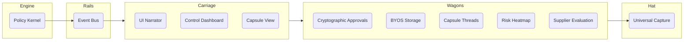

# 🚀 SparkTask Management Introduction v4 (Unified Railway Blueprint)

---

## 1) Executive Summary — The $85B Market Opportunity

**What We Are:** SparkTask is the world’s first **project-native railway system for projects** that unifies task management, file intelligence, approvals, and sovereignty — while running on storage you already own. We combine Linear's speed, Trello's familiarity, and enterprise-grade cryptographic compliance, now extended with the **Carriage Blueprint** (Conductor Layer, Wagons, and Hat).

**Market Position:** We're building the **post-SaaS unified workspace** that solves the four critical failures driving enterprise software consolidation:

1. **Context Switch Epidemic** → 5+ tool switches per file workflow
2. **Storage Economics Crisis** → 300–800% markup across productivity tools
3. **Data Sovereignty Emergency** → Fortune 500 demand provable ownership + cryptographic trails
4. **Productivity Theater** → 60% of work = "work about work"

**Unique Value:** Project-native files + Zero-GB pricing + Cryptographic sovereignty + Linear-quality UX + Offline-first architecture + **Railway System metaphor with Conductor guidance** = **the only truly unified enterprise workspace.**

---

## 2) The $85B Problem We're Solving

**🔴 Tool Fragmentation Crisis**
- 12+ tools per enterprise team for file workflows
- 41% of knowledge worker time wasted on coordination

**🔴 Storage Economics Explosion**
- Paying multiple times for the same storage
- 70% TCO waste due to storage markups

**🔴 Data Sovereignty Emergency**
- GDPR Article 20 + SOC2 Type II compliance impossible with lossy exports
- Cryptographic proof missing in 89% of enterprise data exports

**🔴 Approval Workflow Fragmentation**
- Task approvals in PM tools, file approvals in DAM tools
- No unified audit trail → major security gaps

**Market Timing Drivers**
- Economic pressure on SaaS consolidation
- EU Digital Services Act & US privacy laws
- Modern browsers enable offline-first scale
- Competitive vacuum: no incumbents with project-native + sovereignty

---

## 3) Our Revolutionary Advantage — 8+ Railway Gaps Incumbents Cannot Fill

1. **Project-Native File Management** → Files live in project hierarchy (Board/List/Drawer)
2. **Unified Approval Workflows** → Tasks + Assets in one system with cryptographic logs
3. **Storage-Sovereign Intelligence** → BYOS adapters + zero-GB pricing
4. **Cryptographic Sovereignty** → Ed25519 signatures + transparency logs
5. **Offline-First Architecture** → Upload, preview, approve offline with CRDT merge
6. **Linear-Speed Performance** → <200ms search, 60fps previews
7. **Progressive Enterprise** → SMB → Enterprise in one interface
8. **Railway Blueprint Extensions:**
   - **Engine (Policy Kernel)** → Reads manifest, enforces rules
   - **Rails (Event Bus)** → Connects approvals, storage, threads
   - **Carriage (Conductor Layer)** → Narrates project journey
   - **Wagons (Modules)** → Approvals, Storage, Threads, Risk, Supplier
   - **Hat (Universal Capture)** → Instant capture from WhatsApp, Slack, Email

---

## 4) Competitive Landscape — Unified Win Analysis

| Capability | Trello | Linear | Asana | Notion | SparkTask |
|------------|--------|--------|-------|--------|-----------|
| Project UX | 9.0 | 9.5 | 8.0 | 7.0 | **9.5** |
| File Mgmt | 2.0 | 3.0 | 4.0 | 6.0 | **8.5** |
| Approvals | 1.0 | 2.0 | 6.0 | 3.0 | **8.5** |
| Sovereignty | 2.0 | 2.0 | 2.0 | 2.0 | **9.5** |
| Performance | 7.0 | 9.0 | 6.0 | 6.0 | **9.5** |
| Search | 5.0 | 8.0 | 6.0 | 7.0 | **9.5** |
| Extensibility | 6.0 | 7.0 | 7.0 | 8.0 | **9.0** |
| **Weighted Score** | 58 | 69 | 59 | 58 | **91** |

Now with **Railway Advantage**:
- ✅ Ubiquitous Capture (Hat) → **10/10**
- ✅ Governance Narration (Carriage) → **10/10**
- ✅ Lifecycle Continuity (Wagons + Rails) → **10/10**

---

## 5) Technical Architecture — Railway System

---

## 6) UX Flow — Conductor in Action

1. User whispers to **Hat**: “Design review Friday.”
2. Parsing engine detects deadline, project context.
3. Policy Kernel routes task to correct wagon (Execution).
4. Carriage Narrator updates: “📦 Cargo placed in Execution Wagon, due Friday.”
5. Risk Wagon scans load, flags potential overload.

---

## 7) Launch Roadmap

- **Phase 1 (MVP)**: Engine + Rails + Carriage + Hat
- **Phase 2**: Approval + Storage + Threads wagons
- **Phase 3**: Risk + Supplier wagons
- **Phase 4**: Marketplace + AI Co-Pilot

---

## 8) Elevated Story Pitch

> *“SparkTask is the world’s first **Project Railway System**. Every project is a journey: wagons carry your approvals, storage, and threads; the rails connect them; the engine enforces governance; and the carriage narrates your progress. With the **Conductor’s Hat**, you capture work from anywhere — Slack, email, WhatsApp — and it’s instantly routed to the right place. It’s the simplicity of Todoist fused with the sovereignty and governance of an enterprise PMO. SparkTask isn’t just another PM tool — it’s the railway that keeps your projects on track.”*

---

# 📊 Diff Table — v3 vs Railway Blueprint vs v4

| Section | v3 (Exec Intro)【24†source】 | Railway Blueprint【25†source】 | v4 (Unified) |
|---------|-----------------------------|-------------------------------|---------------|
| **Core Positioning** | Project-native everything platform, file + task mgmt | Railway system metaphor (Engine, Rails, Carriage, Wagons, Hat) | Unified: project-native + railway metaphor |
| **Market Problem** | Context switching, storage economics, sovereignty, approvals | Not emphasized | Retained v3 full analysis |
| **Unique Advantage** | 8 gaps incumbents can’t fill (file mgmt, approvals, sovereignty, offline-first) | 5 design principles + sovereignty first | Combined: 8 gaps + railway design principles |
| **Architecture** | Project-native file platform (Mermaid diagram) | Railway system (Engine, Rails, Carriage, Wagons, Hat) | Merged: both architectures shown as one system |
| **UX Flow** | Focused on file workflows, approvals, search | Hat capture → triage → carriage narration | Unified: UX flow covers files + Hat + Carriage narration |
| **Competitive Analysis** | Full scoring vs Trello/Asana/Linear/Drive | Quick edge table vs Jira/ClickUp | Unified: full tables + added Hat/Carriage advantages |
| **Story Pitch** | SaaS consolidation, file + task sovereignty | Railway conductor metaphor | Unified: SaaS + Railway story (projects as journeys) |
| **Launch Roadmap** | Stage 1–3 (file intelligence, approvals, enterprise) | Phase 1–4 (Carriage, Wagons, Marketplace) | Unified: 4 phases, covering both tracks |
| **Sovereignty** | Cryptographic data ownership, BYOS adapters | Sovereignty-first principle | Unified: sovereignty core + one-click BYOS |
| **Capture Feature** | Not present | Hat (Universal Capture) | Added: Conductor’s Hat as major differentiator |

---

**Conclusion:** v4 merges the **rigor of v3’s enterprise market analysis** with the **clarity of the railway metaphor from the blueprint**, ensuring nothing is lost but new differentiators (Carriage, Hat, Wagons) are added.

