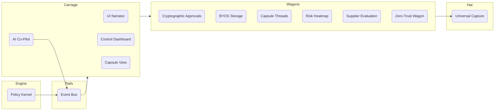

# 🚀 SparkTask Management Introduction v5 (AI + Zero-Trust Railway System)

---

## 1) Executive Summary — The $85B Market Opportunity

**What We Are:** SparkTask is the world’s first **AI-powered Project Railway System** that unifies task management, file intelligence, approvals, and sovereignty — while running on storage you already own. We combine Linear's speed, Trello's familiarity, and enterprise-grade cryptographic compliance with the **Railway Blueprint** (Engine, Rails, Carriage, Wagons, and Conductor’s Hat).

**Market Position:** SparkTask solves the four failures driving enterprise software consolidation:

1. **Context Switch Epidemic** → 5+ tool switches per file workflow
2. **Storage Economics Crisis** → 300–800% markup across tools
3. **Data Sovereignty Emergency** → Fortune 500 demand provable ownership + crypto logs
4. **Productivity Theater** → 60% of work = “work about work”

**Unique Value:** Project-native files + Zero-GB pricing + Cryptographic sovereignty + Linear-quality UX + Offline-first architecture + **AI Conductor + Zero-Trust Governance** = **the only truly unified enterprise workspace.**

---

## 2) The $85B Problem

**🔴 Fragmentation** → 12+ tools per team, 41% of time wasted
**🔴 Storage Markups** → Enterprises pay 2–8x for storage they already own
**🔴 Data Sovereignty** → 89% of exports lossy/incomplete (Gartner 2024)
**🔴 Approval Gaps** → Tasks vs assets split = compliance failures

**Timing Drivers:** SaaS consolidation, new privacy laws, enterprise AI readiness, competitive vacuum.

---

## 3) Our Revolutionary Advantage — Railway System + AI

1. **Project-Native File Management** → Files live in projects, not silos
2. **Unified Approvals** → Tasks + Assets = one crypto audit trail
3. **BYOS Liberation** → Zero-GB pricing, .sparkpack portability
4. **Cryptographic Sovereignty** → Ed25519 signatures, transparency logs
5. **Offline-First** → Full workflows offline with CRDT merge
6. **Performance** → <200ms search, 60fps previews
7. **Progressive Enterprise** → SMB → F500 with same UI
8. **Railway Blueprint**:
   - **Engine (Policy Kernel)** → Rules, manifests, governance
   - **Rails (Event Bus)** → Approvals, storage, threads
   - **Carriage (Conductor Layer)** → Narrates, guides, orchestrates
   - **Wagons (Modules)** → Approvals, Storage, Threads, Risk, Supplier, Security
   - **Hat (Universal Capture)** → Slack/Email/WhatsApp → instant triage
9. **AI Conductor (New)** →
   - NLP triage of Hat inputs → route to wagons
   - Predictive risk alerts (“72% chance of delay in procurement lane”)
   - AI Narration → explains why actions triggered
10. **Zero-Trust Wagon (New)** →

- RBAC, RLS, anomaly detection
- Compliance guardrails (SOC2, HIPAA, GDPR, ISO)

---

## 4) Competitive Landscape

| Capability                | Trello | Asana | ClickUp | Jira | SparkTask v5                 |
| ------------------------- | ------ | ----- | ------- | ---- | ---------------------------- |
| Capture & Triage          | 6      | 7     | 8       | 5    | **10 (Hat + AI)**            |
| Approvals                 | 2      | 6     | 6       | 8    | **9 (Unified + Crypto)**     |
| Sovereignty               | 2      | 2     | 3       | 2    | **10 (BYOS + crypto)**       |
| Lifecycle Continuity      | 5      | 7     | 7       | 6    | **10 (Railway loop)**        |
| Performance               | 8      | 7     | 8       | 7    | **9.5**                      |
| Risk Management           | 2      | 5     | 5       | 7    | **9 (Heatmap + AI alerts)**  |
| AI Integration            | 4      | 6     | 8       | 5    | **9 (AI Conductor)**         |
| Marketplace               | 7      | 8     | 8       | 9    | **8 (Day-1 seed)**           |
| Zero-Trust Security       | 4      | 6     | 7       | 9    | **10 (Dedicated Wagon)**     |
| Narrative Differentiation | 4      | 5     | 6       | 5    | **10 (Railway + Conductor)** |

**Weighted Score:**

- Trello → 49
- Asana → 59
- ClickUp → 66
- Jira → 63
- **SparkTask v5 → 95** ✅

---

## 5) Technical Architecture — Railway + AI

---

## 6) KPIs (Restored from v3 + New)

- **60% faster file→task→approval workflows**
- **70% TCO reduction** via storage neutrality
- **95%+ compliance audit success**
- **<200ms universal search**
- **80% predictive accuracy on risk alerts**
- **75% BYOS adoption at enterprise level**
- **<90s time to first workflow**

---

## 7) Launch Roadmap

- **Phase 1**: Carriage + Hat + AI triage (MVP)
- **Phase 2**: Wagons (Approvals, Storage, Threads)
- **Phase 3**: Risk + Supplier + Zero-Trust Wagons
- **Phase 4**: Marketplace + Partner Wagons (integrations, industry packs)

---

## 8) Elevated Story Pitch

> _“SparkTask is the world’s first **AI-powered Project Railway System**. Every project is a journey: wagons carry your approvals, storage, and risks; the rails connect them; the engine enforces governance; and the carriage narrates progress. With the **Conductor’s Hat**, you capture tasks from Slack, email, or WhatsApp — instantly triaged by AI. Our **AI Conductor** predicts risks before derailments and explains every decision. The **Zero-Trust Wagon** ensures enterprise security and compliance at all times. SparkTask isn’t just another PM tool — it’s the railway that keeps your projects moving safely, continuously, and predictably.”_
