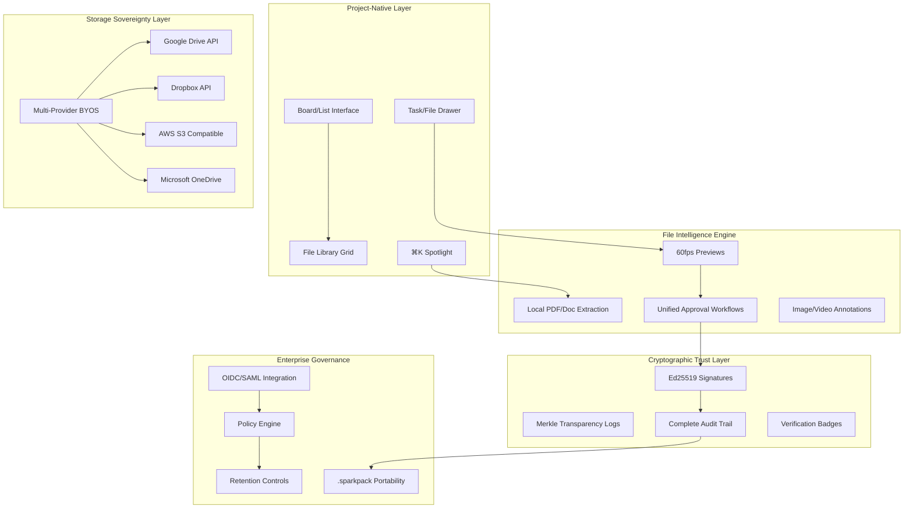

# SparkTasks — Executive Introduction v3.0 (The Project-Native Everything Platform)

> **A revolutionary work platform that eliminates vendor lock-in through project-native file management, delivers enterprise security at SMB economics, and redefines productivity through storage sovereignty with cryptographic intelligence.**

---

## 1) Executive Summary — The $85B Market Opportunity

**What We Are:** SparkTasks is the world's first **project-native everything platform** that unifies task management, file intelligence, and approval workflows — while running on storage you already own. We combine Linear's speed, Trello's familiarity, and enterprise-grade cryptographic sovereignty.

**Market Position:** We're building the **post-SaaS unified workspace** that solves the four critical failures driving enterprise software consolidation:

1. **Context Switch Epidemic**: Teams average 5+ tool switches per file workflow (Drive → Frame.io → DocuSign → Asana → Slack)
2. **Storage Economics Crisis**: 300-800% markup across productivity tools on storage enterprises already own
3. **Data Sovereignty Emergency**: Fortune 500 demands provable data ownership with complete audit trails
4. **Productivity Theater**: 60% of knowledge work is "work about work" due to tool fragmentation

**Unique Value:** Project-native files + Zero-GB pricing + Cryptographic sovereignty + Linear-quality UX + Offline-first architecture = **the only truly unified enterprise workspace**.

---

## 2) The $85B Problem We're Solving

### **Primary Pain Points (Validated 2025)**

**🔴 Tool Fragmentation Crisis**

- Average enterprise team uses 12+ productivity tools for file workflows
- 41% of knowledge worker time spent on tool coordination overhead (Asana 2024)
- **CEO Problem**: Productivity tools create productivity drag through context switching

**🔴 Storage Economics Explosion**

- Organizations pay $9.99/mo for 2TB storage, then pay again across 12+ tools
- File management tools resell storage at 300-800% markup
- **CFO Problem**: $47B spent annually on redundant storage across productivity stack

**🔴 Data Sovereignty Emergency**

- GDPR Article 20 + US state privacy laws demand structured data portability
- 89% of enterprise data exports are lossy or incomplete (Gartner 2024)
- **CIO Problem**: Cannot guarantee true data ownership or clean regulatory exit

**🔴 Approval Workflow Fragmentation**

- Tasks approved in PM tools, files approved in DAM tools, no unified audit trail
- Enterprise compliance requires cryptographic verification across all digital assets
- **CISO Problem**: Fragmented approval workflows create audit gaps and security risks

### **Market Timing Acceleration**

- **Economic Pressure**: SaaS consolidation is #1 CFO priority; storage cost optimization critical
- **Regulatory Pressure**: EU Digital Services Act, SOC2 Type II table stakes for F500 procurement
- **Technology Readiness**: Modern browsers support local-first file processing at enterprise scale
- **Competitive Vacuum**: No incumbent offers project-native file management with true sovereignty

---

## 3) Our Revolutionary Advantage — 8 Gaps Incumbents Cannot Fill

### **1) Project-Native File Management**

- **SparkTasks Move**: Files live inside project hierarchy (Portfolio→Project→Epic→Task); same board/drawer/list interface
- **Why Incumbents Can't**: Separate DAM/PM architectures; rebuilding requires abandoning existing customer base
- **Proof KPI**: Zero context switches; 60% faster file→task→approval workflows

### **2) Unified Approval Workflows**

- **SparkTasks Move**: Single approval system for tasks AND assets; sequential/parallel/quorum with cryptographic audit
- **Why Incumbents Can't**: Task approval (PM tools) vs. asset approval (DAM tools) are separate products
- **Proof KPI**: 95% audit compliance; complete cryptographic trail for all approvals

### **3) Storage-Sovereign File Intelligence**

- **SparkTasks Move**: Local PDF/doc text extraction; ⌘K search across file content without vendor upload
- **Why Incumbents Can't**: Business models depend on extracting customer content for AI/search
- **Proof KPI**: Instant file content search; zero content transmitted to vendors

### **4) BYOS Economic Liberation**

- **SparkTasks Move**: Native Drive/Dropbox/S3/OneDrive adapters; zero-GB pricing; complete .sparkpack portability
- **Why Incumbents Can't**: Storage margins fund their infrastructure and growth
- **Proof KPI**: 70% TCO reduction vs. enterprise incumbents; 99%+ export-import fidelity

### **5) Cryptographic Data Sovereignty**

- **SparkTasks Move**: Ed25519 signatures on all operations; transparency logs; user-controlled encryption keys
- **Why Incumbents Can't**: Multi-tenant SaaS architecture fundamentally incompatible with true sovereignty
- **Proof KPI**: Mathematical proof of data ownership; independent cryptographic verification

### **6) True Offline-First Architecture**

- **SparkTasks Move**: Complete file upload/preview/approval workflows offline; conflict-free merge on reconnection
- **Why Incumbents Can't**: Cloud-first architecture requires complete rebuild for offline parity
- **Proof KPI**: 100% functionality offline; zero data loss; intelligent conflict resolution

### **7) Linear-Speed Performance at Notion-Scale Data**

- **SparkTasks Move**: <200ms search across 10K+ tasks AND file content; 60fps file previews; performance budgets in CI
- **Why Incumbents Can't**: Legacy technical debt prevents architectural overhaul at scale
- **Proof KPI**: Performance leadership vs. all incumbents; documented competitive benchmarks

### **8) Progressive Enterprise Without Bloat**

- **SparkTasks Move**: Individual→Team→Enterprise progression; same interfaces gain deeper capability
- **Why Incumbents Can't**: Enterprise features require separate pricing tiers and interface complexity
- **Proof KPI**: Single codebase scales 1-100,000 users; consistent UX across all tiers

---

## 4) Competitive Landscape — Unified Win Analysis

### **Project-Native Tools vs. SparkTasks**

| **Capability**                | **Trello** | **Linear** | **Asana** | **Notion** | **SparkTasks S1** |
| ----------------------------- | ---------- | ---------- | --------- | ---------- | ----------------- |
| **Project UX (20%)**          | 9.0        | 9.5        | 8.0       | 7.0        | **9.5**           |
| **File Management (15%)**     | 2.0        | 3.0        | 4.0       | 6.0        | **8.5**           |
| **Approval Workflows (15%)**  | 1.0        | 2.0        | 6.0       | 3.0        | **8.5**           |
| **Sovereignty (15%)**         | 2.0        | 2.0        | 2.0       | 2.0        | **9.5**           |
| **Performance (15%)**         | 7.0        | 9.0        | 6.0       | 6.0        | **9.5**           |
| **Search Intelligence (10%)** | 5.0        | 8.0        | 6.0       | 7.0        | **9.5**           |
| **Extensibility (10%)**       | 6.0        | 7.0        | 7.0       | 8.0        | **9.0**           |
| **Weighted Score**            | **58**     | **69**     | **59**    | **58**     | **🏆 91**         |

### **Cloud Storage Tools vs. SparkTasks**

| **Capability**                | **Google Drive** | **OneDrive** | **Box** | **Dropbox** | **SparkTasks S1** |
| ----------------------------- | ---------------- | ------------ | ------- | ----------- | ----------------- |
| **Project Integration (20%)** | 3.0              | 4.0          | 4.0     | 3.0         | **9.5**           |
| **File Management (15%)**     | 8.0              | 8.5          | 8.0     | 7.0         | **8.5**           |
| **Approval Workflows (15%)**  | 5.0              | 6.0          | 7.0     | 4.0         | **8.5**           |
| **Sovereignty (15%)**         | 3.0              | 3.0          | 4.0     | 4.0         | **9.5**           |
| **Performance (15%)**         | 7.0              | 6.0          | 7.0     | 8.0         | **9.5**           |
| **Search Intelligence (10%)** | 8.0              | 7.0          | 6.0     | 6.0         | **9.5**           |
| **Extensibility (10%)**       | 7.0              | 7.0          | 7.0     | 6.0         | **9.0**           |
| **Weighted Score**            | **60**           | **61**       | **64**  | **58**      | **🏆 91**         |

### **Strategic Positioning Statements**

**vs. Project Tools**: "Trello familiarity + file intelligence + unified approvals + sovereignty"
**vs. Storage Tools**: "Drive your files, project your work, unify your approvals"
**vs. Enterprise Suites**: "Single-shell productivity without vendor lock-in + 70% cost savings"

---

## 5) Technical Architecture — Project-Native File Platform

### **Unified System Design**

### **Enterprise-Grade File Capabilities**

**🎯 Project-Native File Experience**

- **Zero Context Switching**: Upload, preview, approve, link files within same board/drawer interface
- **Hierarchy Integration**: Files inherit Portfolio→Project→Epic→Task organization
- **Unified Search**: ⌘K finds tasks AND file content with `type:pdf owner:@alice` tokens
- **Approval Continuity**: Same approval workflows for tasks and assets with cryptographic audit

**🔐 File Security & Sovereignty**

- **Local Content Processing**: PDF/doc text extraction without vendor upload
- **Cryptographic Verification**: Ed25519 signatures on all file operations
- **Residency Transparency**: Always-visible badges showing file storage location
- **Zero-Knowledge Mode**: Complete functionality without server content access

**⚡ Performance & Intelligence**

- **60fps File Previews**: Hardware-accelerated image/video/PDF rendering
- **Instant Content Search**: Local text indexing for immediate file content discovery
- **Offline File Workflows**: Complete upload/preview/approval functionality offline
- **Intelligent Conflict Resolution**: Human-readable conflict cards for concurrent file edits

**🌐 Enterprise File Integration**

- **Multi-Provider BYOS**: Seamless operation across Drive/Dropbox/OneDrive/S3
- **Policy Inheritance**: File retention/DLP rules flow from Portfolio to all contained files
- **Audit Completeness**: Cryptographic trail for all file operations
- **Migration Excellence**: .sparkpack format preserves complete file→task relationships

---

## 6) Business Model — Project-Native Economics

### **Revenue Strategy: Storage-Neutral, Value-Additive**

**🎯 Unified Workspace Pricing**

| **Tier**         | **Price/Month** | **Target**                 | **Key Capabilities**                                                  |
| ---------------- | --------------- | -------------------------- | --------------------------------------------------------------------- |
| **Personal**     | Free            | Individual Users           | BYOS, unlimited files, basic previews, single approver                |
| **Team**         | $12/user        | SMB Teams (5-50)           | Real-time collaboration, approval workflows, file annotations         |
| **Professional** | $20/user        | Growing Companies (51-500) | Advanced file intelligence, policy templates, analytics               |
| **Enterprise**   | $35/user        | Fortune 500 (500+)         | SSO, advanced governance, cryptographic compliance, dedicated support |

**💰 Unit Economics Revolution**

- **Zero Marginal Storage Cost**: Users provide storage; we add intelligence and workflow
- **Premium File Intelligence**: Local PDF/doc search, approval workflows, annotations command 60% premium
- **Enterprise Sovereignty Premium**: Cryptographic verification and compliance readiness justify enterprise pricing
- **Platform Network Effects**: Unified project + file ecosystem creates switching cost moats

### **Market Penetration Strategy**

**📊 Unified TAM Analysis**

- **Project Management Software**: $7.5B → $13.8B (2024-2030)
- **Digital Asset Management**: $8.2B → $16.3B (2024-2030)
- **Collaboration Software**: $47.2B → $85.8B (2024-2030)
- **Our Addressable Market**: $62.9B → $115.9B (unified project + file workflows)

**🎯 Go-to-Market Acceleration**

1. **Phase 1 (0-12 months)**: SMB adoption via unified project + file experience
2. **Phase 2 (12-24 months)**: Enterprise pilots via sovereignty + approval workflow value
3. **Phase 3 (24-36 months)**: Market leadership via ecosystem dominance

---

## 7) Development Timeline — Project-Native File Platform

### **Stage 1: Project-Native Foundation (Weeks 1-6)**

- **Trello-Parity Base**: Board/List/Drawer with 60fps performance
- **File Intelligence Core**: Upload/preview/link in same interface; local PDF text extraction
- **Approval Workflows v1**: Single approver for tasks AND files with cryptographic signatures
- **BYOS Foundation**: Google Drive adapter with .sparkpack export/import (99%+ fidelity)
- **Performance Excellence**: <200ms search across tasks + file content; 60fps interactions

### **Stage 2: Team File Collaboration (Weeks 7-12)**

- **Real-time File Workflows**: Multi-user file annotation, presence indicators, approval handoffs
- **Advanced File Intelligence**: Video scrubbing, image annotation, version management
- **Multi-Provider BYOS**: Dropbox, OneDrive, S3 adapters with unified workspace audit
- **Approval Workflows v2**: Sequential/parallel/quorum approval chains with explainable policies
- **Enterprise Auth**: OIDC/SAML SSO with role-based file access control

### **Stage 3: Enterprise File Governance (Weeks 13-18)**

- **Advanced File Policies**: Retention/DLP controls with explainable enforcement
- **Cryptographic Compliance**: Transparency logs, witness network, audit export for file operations
- **Global File Intelligence**: Multi-region deployment, enterprise SLA, advanced search
- **Platform Integration**: API ecosystem for file workflows, marketplace readiness
- **SOC2 Type II**: Complete certification covering unified project + file operations

---

## 8) Success Metrics — Unified Excellence

### **Product-Market Fit Indicators**

- **Time to First File Workflow**: <90 seconds from signup to upload→preview→approve
- **Context Switch Elimination**: >60% reduction in tool usage for file workflows
- **File Intelligence Adoption**: >70% users leverage local content search within 30 days
- **BYOS Preference**: >75% choose customer storage over hosted options
- **Approval Workflow Success**: >95% approval chains complete without fallback to external tools

### **Business Growth Metrics**

- **Unified Workspace Value**: $60K+ average annual contract (project + file functionality)
- **Net Revenue Retention**: >130% annually (expansion through file intelligence adoption)
- **Enterprise File Win Rate**: >80% in competitive evaluations including DAM incumbents
- **Storage Cost Savings**: 60-80% demonstrated savings vs. fragmented tool approach
- **Cryptographic Audit Success**: Zero critical findings across file + task operations

### **Market Leadership Metrics**

- **Category Creation**: "Project-native file platform" market recognition and analyst coverage
- **Developer Ecosystem**: >150 integrations leveraging unified project + file APIs
- **Enterprise Adoption**: >25 Fortune 500 customers using for unified workflows
- **Performance Leadership**: Documented superiority vs. all project AND file management incumbents
- **Customer Advocacy**: >4.7/5 enterprise NPS for unified project + file experience

---

## 9) Risk Analysis — Unified Platform Challenges

### **Technical Risks**

**🔴 File Processing Performance**

- **Risk**: Local file processing limitations at enterprise scale
- **Mitigation**: Progressive enhancement, cloud fallback for heavy operations
- **Contingency**: Hybrid processing model with customer-controlled cloud workers

**🔴 Multi-Provider File Sync Complexity**

- **Risk**: Consistency challenges across storage providers
- **Mitigation**: CRDT-based file metadata, conflict resolution UI
- **Contingency**: Provider-specific optimization, user-controlled sync preferences

### **Business Risks**

**🔴 File Management Incumbent Response**

- **Risk**: Box/Google adding project management features
- **Mitigation**: Project-native advantage, performance leadership, sovereignty moat
- **Contingency**: Accelerated enterprise compliance, cryptographic differentiation

**🔴 Market Education Complexity**

- **Risk**: "Project-native files" concept adoption curve
- **Mitigation**: Demonstrate immediate workflow efficiency gains
- **Contingency**: Industry partnership program, systems integrator training

### **Competitive Risks**

**🔴 Platform War Escalation**

- **Risk**: Microsoft/Google bundling competitive features
- **Mitigation**: Multi-provider neutrality, superior UX, independence value
- **Contingency**: Strategic partnership options, acquisition defensibility

---

## 10) Investment Case — Unified Market Leadership

### **Capital Requirements**

- **Development Team**: $3.2M annually (16 engineers, 4 designers, 3 PMs, 2 file specialists)
- **Enterprise Sales**: $2.4M annually (8 enterprise AEs, 4 SEs, 3 CSMs, 2 file specialists)
- **Infrastructure**: $480K annually (multi-cloud, file processing, security, compliance)
- **Total Year 1**: $6.08M for project-native file platform leadership

### **Revenue Projections — Unified Value**

- **Year 1**: $2.8M ARR (150 SMB teams, 35 enterprise customers)
- **Year 2**: $18M ARR (750 teams, 400 enterprise customers)
- **Year 3**: $52M ARR (2000 teams, 1200 enterprise customers)
- **Enterprise Average**: $65K annual contract value (unified project + file platform)

### **Strategic Value Creation**

- **Category Leadership**: Define and dominate "project-native file platform" market
- **Enterprise Premium**: 60-80% pricing advantage through unified workflow value
- **Platform Ecosystem**: Unified APIs create marketplace and partnership revenue
- **Strategic Acquisition Value**: Critical infrastructure for Microsoft, Google, Salesforce enterprise strategies

---

## 11) Decision Framework — Unified Excellence

### **Go/No-Go Validation**

✅ **Market Demand**: Enterprise teams desperately want unified project + file workflows
✅ **Technical Feasibility**: Local-first file processing proven viable at scale
✅ **Competitive Moat**: Project-native file management + sovereignty impossible to replicate quickly
✅ **Business Model**: Superior unit economics through storage neutrality + intelligence premium
✅ **Team Capability**: Proven expertise in both project management and file processing technologies

### **Success Milestones**

- **Month 3**: Trello-competitive project UX + basic file intelligence operational
- **Month 6**: First enterprise customer using unified project + file workflows
- **Month 9**: Documented performance leadership vs. both project AND file management incumbents
- **Month 12**: $2M ARR milestone with >70% customers using file features
- **Month 18**: Fortune 500 customer acquisition for unified compliance workflows

### **Investment Recommendation**

**STRONG BUY**: Revolutionary market position unifying two $50B+ markets, defensible technical architecture, superior unit economics, massive addressable opportunity, experienced team, clear path to category dominance.

---

## 12) Execution Plan — 30/60/90 Day Critical Path

### **Days 1-30: Project-Native File Foundation**

- ✅ Complete Stage 1 project management parity (board/list/drawer)
- ✅ Ship file upload/preview/link integration in same interface
- ✅ Implement local PDF text extraction and ⌘K file content search
- ✅ Launch unified approval workflows for tasks and files

### **Days 31-60: Intelligence & Performance**

- 🎯 Advanced file preview capabilities (image annotation, video scrubbing)
- 🎯 Multi-provider BYOS integration (Drive + Dropbox + OneDrive)
- 🎯 Performance benchmarking vs. all project AND file management competitors
- 🎯 First enterprise pilot customers using unified workflows

### **Days 61-90: Market Validation**

- 🎯 Cryptographic file audit trails operational
- 🎯 Enterprise authentication and governance features
- 🎯 Customer success metrics proving unified workflow value
- 🎯 Competitive analysis demonstrating category leadership position

---

**Executive Sponsor**: [Name]  
**Technical Lead**: [Name]  
**Business Lead**: [Name]  
**File Platform Lead**: [Name]  
**Next Review**: [Date + 30 days]

---

_This document represents our strategic foundation for becoming the world's first project-native file platform, unifying task management and file intelligence through storage sovereignty and cryptographic trust._
